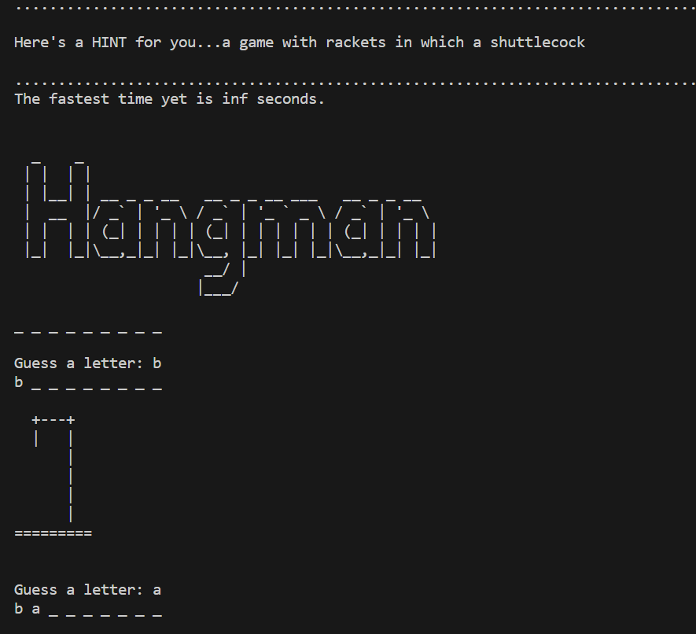
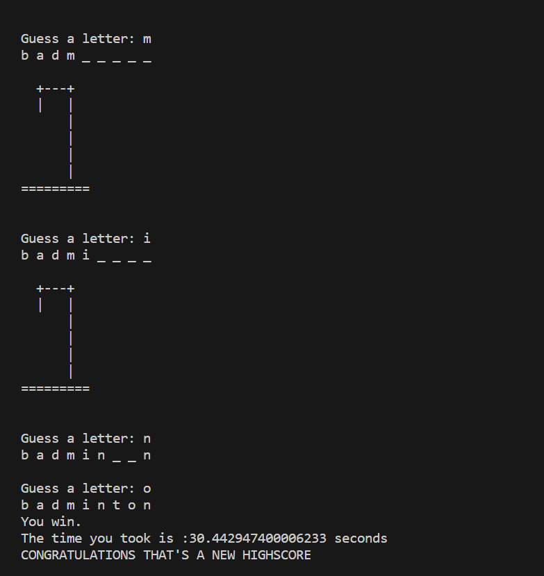
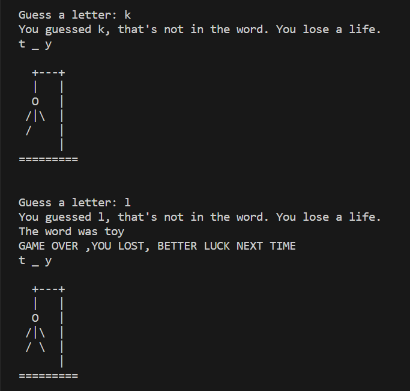

<h1>Hangman Game</h1>
This Python code is a simple implementation of the hangman game. It allows a player to guess letters to uncover a hidden word by providing a hint.
This code is a command-line game of Hangman. Here is a short description of five key points:

<h3>Word Selection:</h3>The code randomly selects a word from a dictionary (word_list) and provides a clue for the chosen word. The words and their corresponding definitions are stored as key-value pairs.

<h3>Game Logic;</h3> The game starts with a blank representation of the word, where each letter is replaced with an underscore. The player guesses letters, and if the letter is present in the word, it is revealed in the corresponding positions. Incorrect guesses result in a loss of life.

<h3>User Interaction:</h3> The player interacts with the game by entering letters as guesses. The code checks if the letter has already been guessed and updates the display accordingly. It also keeps track of the number of lives remaining.

<h3>Game Outcome:</h3> The game continues until the player either guesses all the letters in the word or runs out of lives. If the player wins, the time taken to complete the game is recorded. If the time is faster than the current high score (stored in highscoretime.txt), it becomes the new high score.

<h3>Graphics:</h3> The code uses ASCII art stored in the stages list to display a hangman figure that changes based on the number of lives remaining. The logo variable contains the title of the game, which is printed at the beginning.
 

 

 

